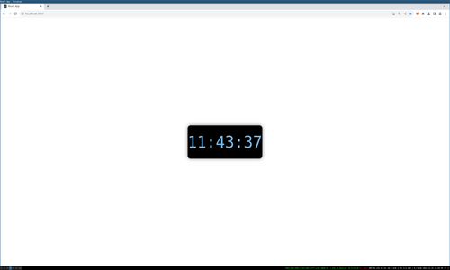

# Clock

## Overview

This is a simple React clock app made with TypeScript.

This project was bootstrapped with [Create React App](https://github.com/facebook/create-react-app).

## Features

This app the time digitally in the center of the screen, in the format of hours:minutes:seconds.

Click on it to switch the time format display to military time. Click to revert it to regular time.

## How To Run

In the project directory, you can run:

### `npm start`

Open [http://localhost:3000](http://localhost:3000) to view it in the browser.

